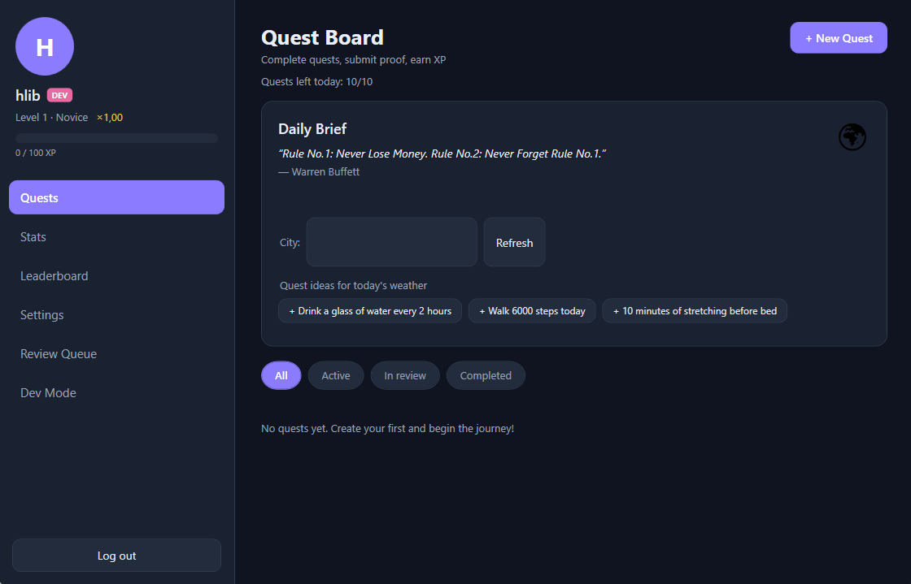
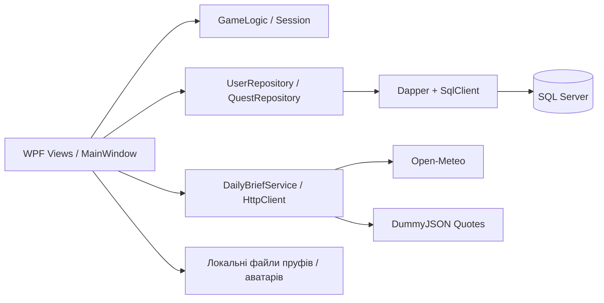
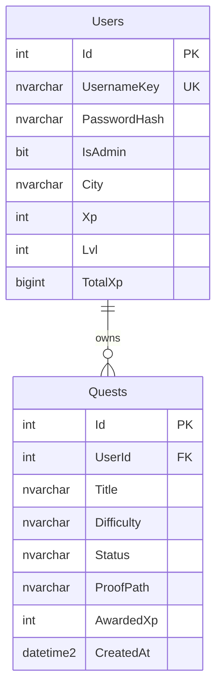
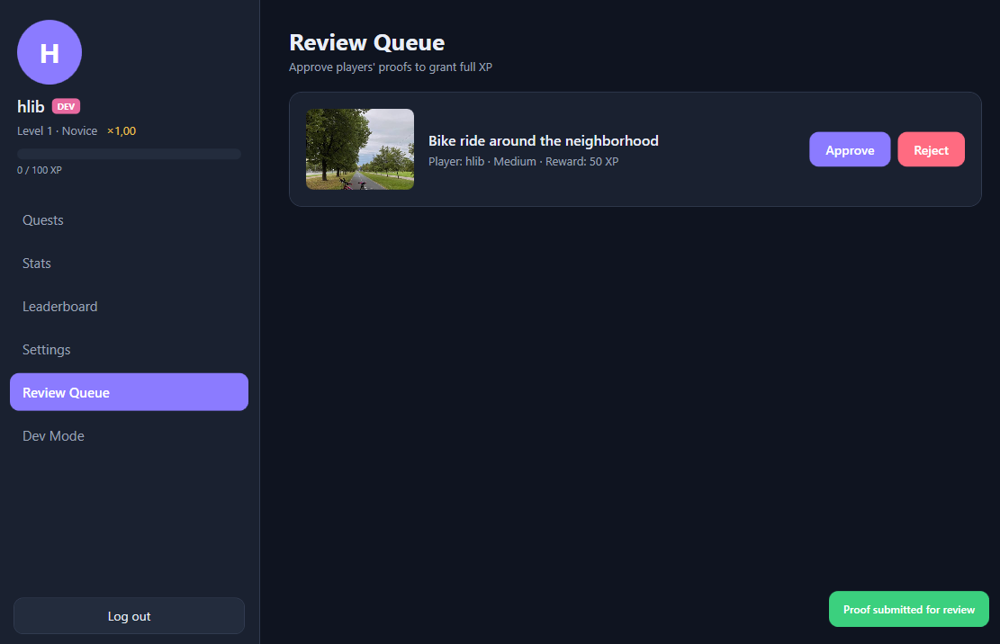
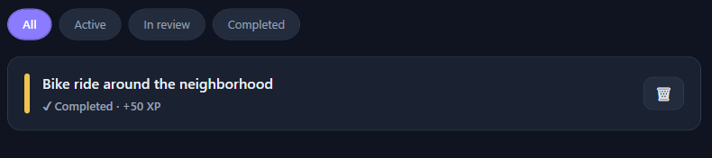
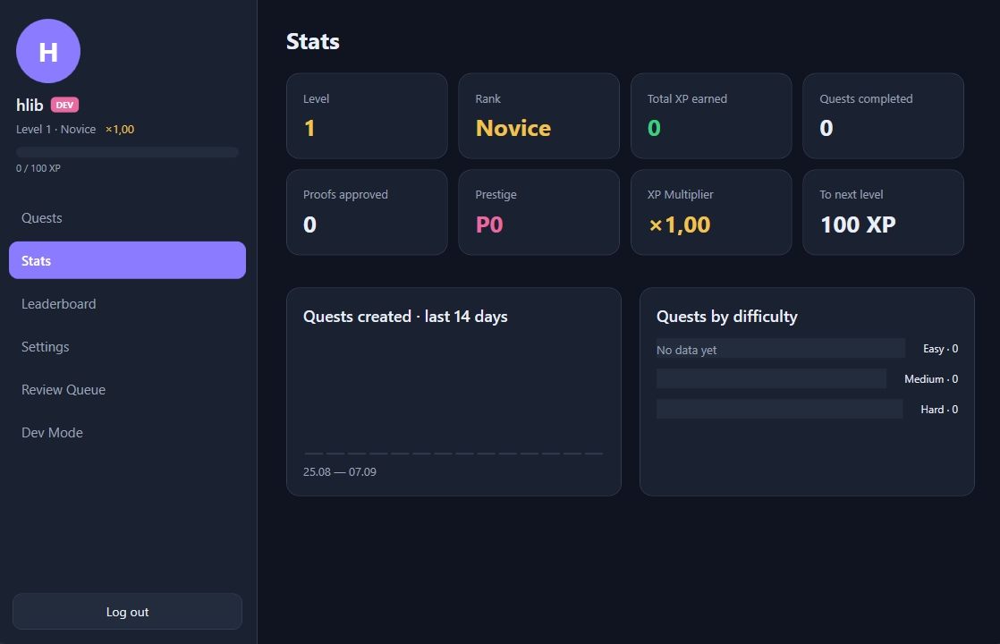
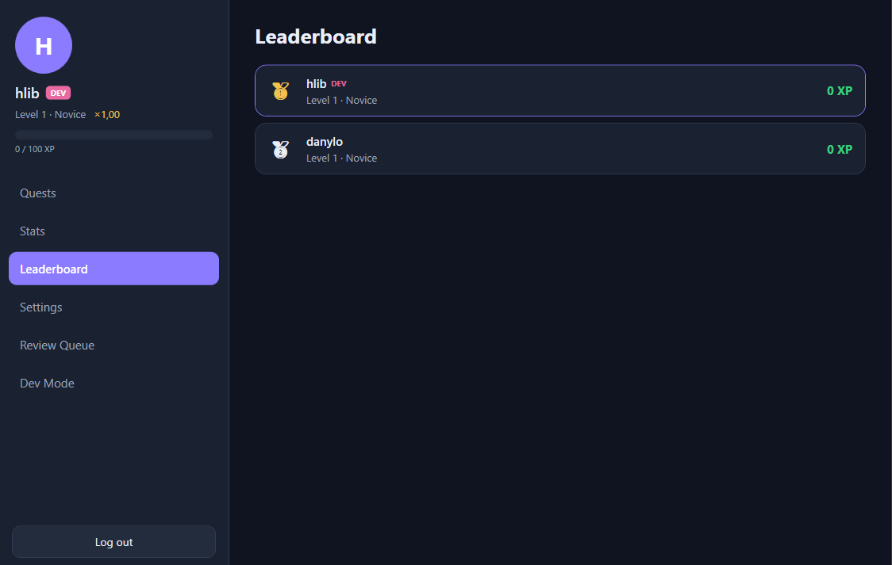
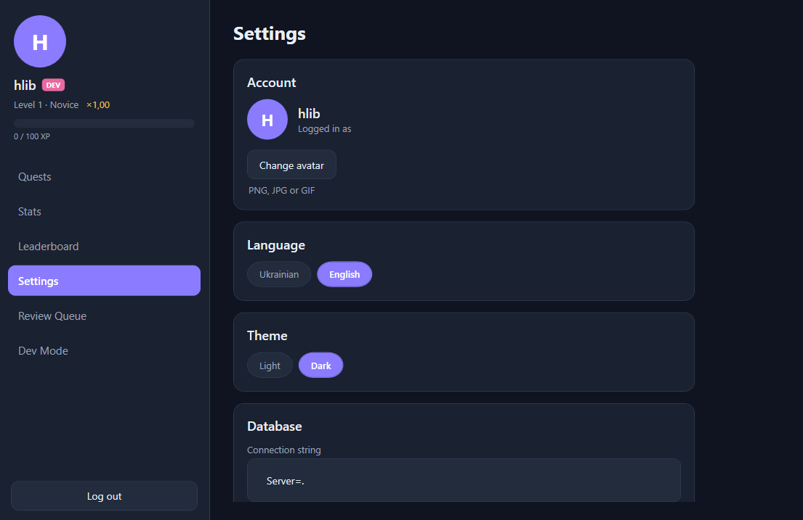

# LifeQuest 3.0

**Гейміфікований трекер щоденних справ для Windows: створюй квести, підтверджуй виконання й розвивай свого персонажа.**

LifeQuest перетворює список завдань на систему прогресу з XP, рівнями, рангами та престижем. Проєкт розвиває [десктопну версію 2.0](https://github.com/kurokawa1337/LifeQuest-2.0): у поточній реалізації є Dapper, асинхронний доступ до даних, зовнішні API та паралельні обчислення статистики.

Навчальний проєкт на C# / WPF. Дані зберігаються в SQL Server, а пруфи й аватари залишаються локальними файлами.



## Можливості

- Реєстрація та вхід під локальним акаунтом.
- Створення квестів із назвою, описом і складністю; видалення та фільтри за статусом.
- Завершення без пруфу зі зменшеною винагородою або надсилання файлу на ручну перевірку адміністратору.
- XP, рівні, ранги, престиж і множник винагороди.
- Таблиця лідерів за загальним XP.
- Статистика профілю, кількість створених квестів за останні 14 днів і розподіл за складністю.
- «Бріф дня»: випадкова цитата, погода для введеного міста й три тематичні ідеї квестів.
- Українська та англійська локалізації, світла й темна теми, власний аватар.
- Адміністративна черга пруфів і режим розробника для тестування прогресу.

Ідеї квестів беруться з локалізованих шаблонів за категорією погоди. Це не генерація через ШІ. Цитата надходить з API без перекладу та може змінюватися після оновлення брифу.

## Технології та вимоги курсової

| Вимога | Реалізація | Де подивитися |
| --- | --- | --- |
| C# | .NET 10, `net10.0-windows` | [LifeQuest.csproj](LifeQuest/LifeQuest.csproj) |
| Графічний інтерфейс | WPF, XAML, code-behind | [Views](LifeQuest/Views), [MainWindow](LifeQuest/MainWindow.xaml.cs) |
| Реляційна БД | SQL Server, дві пов'язані таблиці, PK, FK, UNIQUE, індекс | [Database.cs](LifeQuest/Data/Database.cs) |
| ORM | Dapper 2.1.66, мапінг SQL-результатів на C#-об'єкти | [UserRepository.cs](LifeQuest/Data/UserRepository.cs), [QuestRepository.cs](LifeQuest/Data/QuestRepository.cs) |
| SQL-драйвер | Microsoft.Data.SqlClient 7.0.2 | [LifeQuest.csproj](LifeQuest/LifeQuest.csproj) |
| Асинхронність | `async/await`, асинхронні методи Dapper, `OpenAsync`, HTTP-запити | [Data](LifeQuest/Data), [DailyBriefService.cs](LifeQuest/Services/DailyBriefService.cs) |
| Конкурентне виконання | Погода та цитата завантажуються через `Task.WhenAll` | [DailyBriefService.cs](LifeQuest/Services/DailyBriefService.cs) |
| Паралельні обчислення | PLINQ, `AsParallel()` у статистиці | [StatsView.xaml.cs](LifeQuest/Views/StatsView.xaml.cs) |
| Зовнішні API | Open-Meteo Geocoding / Forecast, DummyJSON Quotes | [DailyBriefService.cs](LifeQuest/Services/DailyBriefService.cs) |

Dapper є micro-ORM: запити залишаються явним SQL, а бібліотека виконує їх і перетворює результати на об'єкти. Створення БД і початкова зміна схеми виконуються через `SqlClient`, а не міграції EF Core.

## Як запустити

### Передумови

- Windows із підтримкою .NET 10.
- .NET 10 SDK.
- Запущений SQL Server, наприклад SQL Server Express з інстансом `.\SQLEXPRESS`.
- Windows-акаунт із доступом до SQL Server та правами на створення БД, якщо вона ще не існує.
- Інтернет для відновлення NuGet-пакетів і зовнішніх API. Для квестів і профілю потрібна доступна БД, але не погодний сервіс.

### Збірка та запуск із кореня репозиторію

```powershell
git clone https://github.com/kurokawa1337/LifeQuest-3.0.git
cd LifeQuest-3.0
dotnet restore LifeQuest.slnx
dotnet build LifeQuest.slnx
dotnet run --project LifeQuest/LifeQuest.csproj
```

Альтернатива: відкрити `LifeQuest.slnx` у Visual Studio з підтримкою .NET 10 та встановленими засобами розробки класичних .NET-застосунків.

При запуску застосунок перевіряє БД, створює її за відсутності та ініціалізує таблиці. SQL Server має бути встановлений і запущений окремо: застосунок не встановлює сервер.

### Рядок підключення

За замовчуванням:

```text
Server=.\SQLEXPRESS;Database=LifeQuest;Trusted_Connection=True;TrustServerCertificate=True;Encrypt=False;
```

Налаштування читаються з `appsettings.json` **поряд із виконуваним файлом**. Для звичайної Debug-збірки це `LifeQuest/bin/Debug/net10.0-windows/appsettings.json`.

```json
{
  "ConnectionString": "Server=.\\SQLEXPRESS;Database=LifeQuest;Trusted_Connection=True;TrustServerCertificate=True;Encrypt=False;"
}
```

Для іншого SQL Server змінити `Server`, за потреби `Database` та спосіб автентифікації. Файл можна створити після `dotnet build`, до першого запуску. Якщо підключення не вдалося, застосунок показує повідомлення та завершується: виправити JSON і запустити повторно.

У поточному `SettingsView` є показ рядка та перевірка поточного підключення; збереження нового рядка з цього екрана не реалізоване. Для зміни конфігурації потрібно відредагувати файл і перезапустити застосунок.

> Ця конфігурація призначена для локального навчального середовища. Для віддаленого сервера потрібні належні налаштування TLS, перевірка сертифіката та обмежені права доступу.

## Перші кроки

1. Зареєструвати акаунт і увійти.
2. У розділі квестів натиснути **New Quest / Новий квест**, вказати справу та складність.
3. За бажанням ввести місто в брифі й натиснути **Refresh / Оновити**. Натискання на ідею відкриває форму створення квесту з готовою назвою.
4. Виконати квест: пропустити пруф для часткової винагороди або надіслати файл на перевірку.
5. Після підтвердження адміністратором перевірити XP, статистику та місце в рейтингу.

## Ігрова логіка

| Складність | Базовий XP із підтвердженим пруфом | Без пруфу при множнику ×1 |
| --- | ---: | ---: |
| Easy | 25 | 8 |
| Medium | 50 | 17 |
| Hard | 100 | 33 |

- Без пруфу базова винагорода множиться на `1/3` і округлюється через `Math.Round`; потім застосовується множник профілю й повторне округлення.
- XP для переходу з поточного рівня: `floor(100 × level^1.35)`.
- Ранги змінюються кожні 10 рівнів: від `Novice` до `Legend`.
- Максимальний рівень: **100**.
- На день можна створити до **10** квестів. Видалення не повертає витрачений слот.
- Престиж доступний на 100 рівні: рівень повертається до 1, поточний XP скидається, множник розраховується як `1 + prestige × 0.25`, із верхньою межею ×10. Загальний накопичений XP зберігається.
- Рейтинг обирає до 100 користувачів за `TotalXp DESC`, потім `Lvl DESC`.

Реалізація: [GameLogic.cs](LifeQuest/Services/GameLogic.cs).

## Дані та архітектура

Це WPF-застосунок з обробниками в code-behind, окремими сервісами та репозиторіями. Повний MVVM і окремий серверний backend у поточній версії не реалізовані.



### Схема БД



Схема показує ключові поля, а не всі колонки.

**Users** зберігає акаунт, хеш пароля, роль, налаштування та прогрес. `UsernameKey` є нормалізованим унікальним ім'ям користувача. `Profile` у C# не є окремою таблицею: його поля зберігаються в `Users`.

**Quests** посилається на `Users.Id`. Є зовнішній ключ із `ON DELETE CASCADE` та індекс `IX_Quests_UserId`. Статуси: `active`, `pending`, `done`.

Ініціалізація додає `Users.City`, якщо цієї колонки немає у старій БД. Це цільове оновлення схеми, не загальна система версійованих міграцій.

### Локальні файли

Пруфи копіюються в `data/proofs`, аватари в `data/avatars` поряд із виконуваним файлом. У БД зберігаються шляхи, не двійковий вміст. Для резервної копії потрібні і БД, і ці каталоги; перенесення на інший ПК потребує перевірки шляхів.

## API, асинхронність і паралельність

- **Open-Meteo Geocoding** визначає координати за містом; потім **Forecast API** повертає температуру, код погоди та швидкість вітру.
- **DummyJSON Quotes** повертає випадкову цитату: `https://dummyjson.com/quotes/random`.
- Використовується спільний `HttpClient` із таймаутом 8 секунд на запит, JSON десеріалізується через `System.Net.Http.Json`.
- Погодний ланцюжок і цитата стартують конкурентно; `Task.WhenAll` очікує обидва результати. Геокодування та прогноз усередині погодного ланцюжка послідовні.
- Помилка одного джерела не відкидає успішний результат іншого. Якщо погода недоступна, використовуються загальні ідеї.
- Ключі API у поточній реалізації не потрібні.
- Читання та запис у репозиторіях виконуються асинхронними методами Dapper.
- У статистиці застосовано PLINQ для підрахунків за днями та складністю.

`async/await` для I/O не означає окремий потік на кожен запит. PLINQ виконує паралельні обчислення, але підсумкова агрегація в цьому коді очікується синхронно; копіювання файлів і хешування паролів теж залишаються синхронними.

## Адміністрування та безпека

У навчальній версії роль адміністратора автоматично отримує акаунт із нормалізованим ім'ям `hlib`. Це правило в коді, а не готовий акаунт із відомим паролем.

Адміністратор підтверджує або відхиляє пруф. Підтвердження переводить квест у `done` і нараховує повний XP; відхилення повертає його в `active`. Режим розробника дозволяє змінювати XP / рівень і скидати профіль для тестів.

Паролі хешуються через **PBKDF2-SHA256**: випадкова 16-байтна сіль, 100 000 ітерацій, 32-байтний хеш. Перевірка використовує `FixedTimeEquals`. Значення користувацького вводу передаються SQL-параметрами.

> Це навчальна десктопна модель, не готова система безпеки для публічного сервісу. Перед публічним використанням необхідно замінити правило адміністратора за нікнеймом, додати перевірку прав на серверному рівні та не надавати клієнтам прямий привілейований доступ до БД.

## Перевірка через SmokeTest

```powershell
dotnet run --project SmokeTest/SmokeTest.csproj
```

У [SmokeTest/Program.cs](SmokeTest/Program.cs) є **24 перевірки**: ініціалізація БД, користувачі й паролі, квести та черга пруфів, збереження прогресу, формули XP і престижу, категорії погоди, рейтинг і видалення квесту.

Якщо всі перевірки успішні, програма друкує `ALL PASS` і повертає код 0; при невдалих перевірках повертає 1. Це очікувана поведінка тесту, а не підтвердження нового запуску на цій версії.

**Перед запуском:** рядок підключення заданий окремою константою `cs` у `SmokeTest/Program.cs`, а не береться з налаштувань WPF. Для ізольованого прогону змінити назву БД, наприклад на `LifeQuest_Test`.

Тест працює зі справжнім SQL Server і записує дані. Тестовий квест видаляється в кінці, але акаунт `smoke_...` залишається. Реальні HTTP-запити та WPF-взаємодії цим тестом не перевіряються; для погоди перевіряється лише класифікація кодів.

## Скриншоти

Скріншоти демонструють англомовний інтерфейс у темній темі. На брифі місто не введене, тому погодні значення не показані; статистика знята на профілі без накопичених даних. Це різні стани застосунку, не єдина безперервна сесія.

### Перевірка пруфів


### Завершений квест


### Статистика


### Таблиця лідерів


### Налаштування


## Структура репозиторію

```text
LifeQuest-3.0/
├── LifeQuest.slnx
├── LifeQuest/
│   ├── Data/          ініціалізація БД та Dapper-репозиторії
│   ├── Models/        User, Quest, Profile
│   ├── Services/      ігрова логіка, API, сесія, конфігурація, локалізація
│   ├── Themes/        ресурси тем і спільні стилі
│   ├── Views/         квести, статистика, рейтинг, налаштування, admin, dev
│   ├── App.xaml.cs    асинхронна ініціалізація
│   └── MainWindow    вхід, навігація та панель профілю
├── SmokeTest/         консольні перевірки через SQL Server
└── docs/screenshots/  скриншоти для цього README
```

## Поточні обмеження та наступні кроки

- Оновлення квесту та XP користувача виконуються окремими запитами без спільної транзакції. Потрібні атомарне завершення й захист від подвійного нарахування при конкурентних діях.
- У графіку за днями PLINQ використовується без `AsOrdered()`: порядок результатів не гарантований. Перед точним аналізом слід зберігати пару «дата + кількість» або забезпечити порядок.
- Частина операцій виконується на UI-потоці; для великих файлів чи даних потрібні окремі поліпшення чуйності інтерфейсу.
- Немає централізованого сервера, синхронізації медіафайлів, OAuth чи автоматичної перевірки пруфів через ШІ.
- До публічного релізу потрібні повноцінні ролі, керовані міграції, додаткові обмеження даних та ширше тестування.

Рекомендований найближчий етап: транзакції, стабільний порядок статистики, тестове середовище й очищення репозиторію від `bin/`, `obj/` та локальних даних. Далі: серверний API, синхронізація та розвиток механік звичок.

## Автор

[kurokawa1337](https://github.com/kurokawa1337) · [Репозиторій LifeQuest 3.0](https://github.com/kurokawa1337/LifeQuest-3.0)
